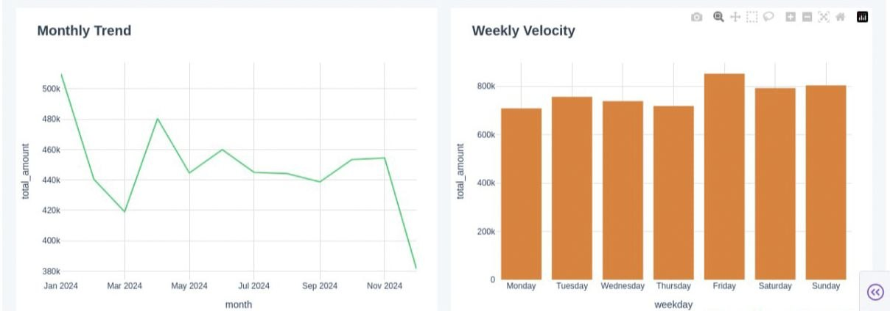

# Sales Data Pipeline + Dashboard

## What this project is

This is an end-to-end data pipeline that takes raw sales data, processes it, and turns it into a structured warehouse with a live dashboard on top.

No drag-and-drop tools. Just Python and PostgreSQL.

---

## What it does

* Ingests raw CSV data into staging tables
* Transforms data into a star schema (fact + dimensions)
* Loads it into a PostgreSQL warehouse
* Serves insights through an interactive dashboard

---

## Tech stack

* Python
* PostgreSQL
* Pandas
* SQLAlchemy
* Dash
* Linux (VM)

---

## Data model

**Staging**

* `staging.sales_raw`

**Warehouse**

* `warehouse.dim_products`
* `warehouse.dim_regions`
* `warehouse.fact_sales`

---

## Dashboard

## Dashboard Preview




---

## What the data shows

From 10,000 records:

* Total revenue: $5.37M
* Orders: 10,000
* Customers: 500
* Average ticket: $537

Some quick observations:

* Electronics dominate revenue
* Notebooks outperform higher-priced items
* Weekdays perform better than weekends
* Revenue trend is relatively flat over time

---

## How to run it

```bash
# install dependencies
pip install pandas sqlalchemy psycopg2-binary dash

# setup database
sudo -u postgres psql -f schema.sql

# run pipeline
python3 transform_load.py

# start dashboard
python3 dashboard.py
```

Then open:
http://localhost:8080

---

## Project structure

* `transform_load.py` → main ETL pipeline
* `ingest_data.py` → loads raw data into staging
* `schema.sql` → database schema
* `generate_data.py` → generates sample data
* `dashboard.py` → dashboard app
* `assets/` → dashboard screenshots

---

## What’s missing / next steps

* Incremental loading (currently full refresh)
* Proper orchestration (cron works, but not ideal)
* Error handling and logging
* Deployment (cloud / public access)

---

## Why I built this

To practice building a real pipeline end-to-end:

* not just queries
* not just dashboards
* the whole flow from raw data to insights
