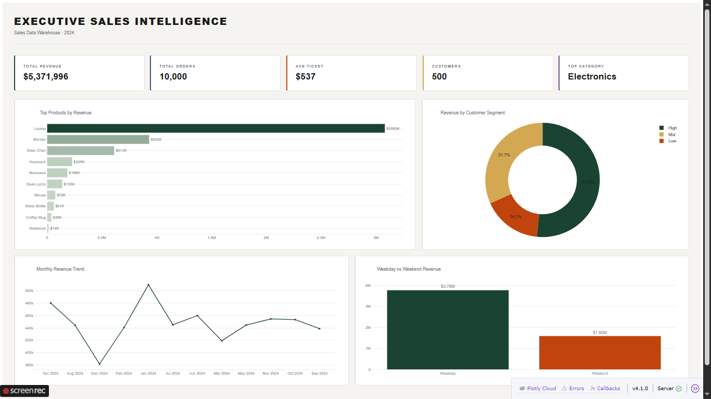

# Sales Data Pipeline


An end-to-end data pipeline that generates synthetic sales data, ingests it into a PostgreSQL warehouse, transforms it into a star schema, and serves insights through an interactive dashboard — built entirely with Python and PostgreSQL.

The dataset itself is fully generated using custom logic to simulate real-world sales patterns (customers, products, regions, and transaction behavior).

---

## Table of Contents

- [Pipeline Flow](#pipeline-flow)
- [Technology Stack](#technology-stack)
- [Quick Start](#quick-start)
- [Data Warehouse Schema](#data-warehouse-schema)
- [Dashboard Preview](#dashboard-preview)
- [Project Structure](#project-structure)
- [What's Next](#whats-next)

---

## Pipeline Flow

```mermaid
graph LR
    A[CSV / Sample Data] --> B[Python Ingestion]
    B --> C[(PostgreSQL Staging)]
    C --> D[Transform & Load]
    D --> E[(Warehouse: Star Schema)]
    E --> F[Dash Dashboard]

**ETL Stages:**

| Stage | Script | Description |
|---|---|---|
| Generate | `generate_data.py` | Simulates realistic sales data (customers, products, regions, transactions) |
| Ingest | `ingest_data.py` | Loads raw CSV into staging table |
| Transform & Load | `transform_load.py` | Builds all dimensions and fact table |
| Serve | `dashboard.py` | Launches interactive Dash dashboard |


---

## Technology Stack

| Layer | Technology | Purpose |
|---|---|---|
| Language | Python 3.10+ | Pipeline logic and dashboard |
| Data Warehouse | PostgreSQL 15 | Staging and warehouse storage |
| Data Processing | Pandas | Data transformation and prep |
| DB Connector | SQLAlchemy + psycopg2 | Database connection and queries |
| Dashboard | Dash + Plotly | Interactive visual dashboard |
| Environment | Linux (Ubuntu VM) | Pipeline execution environment |

---

## Quick Start

```bash
# 1. Clone the repository
git clone https://github.com/Yasmeen327/sales-data-pipeline.git
cd sales-data-pipeline

# 2. Install dependencies
pip install pandas sqlalchemy psycopg2-binary dash plotly

# 3. Set up the database
sudo -u postgres psql -d sales_db -f schema.sql

# 4. Grant permissions
sudo -u postgres psql -d sales_db -c "GRANT ALL PRIVILEGES ON ALL TABLES IN SCHEMA warehouse TO pipeline_user;"
sudo -u postgres psql -d sales_db -c "GRANT ALL PRIVILEGES ON ALL SEQUENCES IN SCHEMA warehouse TO pipeline_user;"

# 5. Generate and ingest data
python3 generate_data.py
python3 ingest_data.py

# 6. Run the pipeline
python3 transform_load.py

# 7. Launch the dashboard
python3 dashboard.py
```

Then open: `http://localhost:8080`

---

## Data Warehouse Schema

**Staging**

| Table | Description |
|---|---|
| `staging.sales_raw` | Raw ingested sales records |

**Dimensions**

| Table | Description |
|---|---|
| `warehouse.dim_date` | Calendar attributes — day, week, month, quarter, year, is_weekend |
| `warehouse.dim_customers` | Customer master — segment (High / Mid / Low), lifetime value, order history |
| `warehouse.dim_products` | Product catalog — name, category, price |
| `warehouse.dim_regions` | Region master — region name, country |

**Fact**

| Table | Description |
|---|---|
| `warehouse.fact_sales` | Transactional sales data linked to all four dimensions |

---

## Dashboard Preview



### Key Metrics
- **Total Revenue:** $5.37M
- **Total Orders:** 10,000
- **Average Ticket:** $537
- **Unique Customers:** 500

### Insights
- Electronics dominate revenue — Laptops account for the largest share by far
- High-value customers drive a disproportionate portion of total revenue
- Weekday revenue significantly outperforms weekends

---

## Project Structure

```
sales-data-pipeline/
├── generate_data.py       # Generates synthetic sales CSV
├── ingest_data.py         # Loads CSV into staging table
├── transform_load.py      # ETL — builds all dimensions and fact table
├── dashboard.py           # Interactive Dash dashboard
├── schema.sql             # Full database schema (staging + warehouse)
├── sales_data.csv         # Sample data file
├── assets/                # Dashboard screenshots
└── README.md
```

---

## What's Next

- [ ] Incremental loading (replace full refresh)
- [ ] Orchestration with Apache Airflow
- [ ] Error handling and pipeline logging
- [ ] Cloud deployment (AWS / GCP)
- [ ] Add data quality checks

---

## License

This project is licensed under the MIT License.
